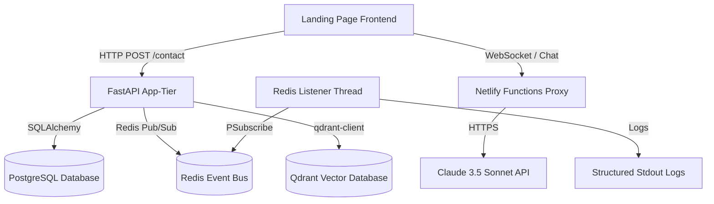

# Architecture Overview — OASIS SYSTEM CORE v∞

This document describes the decoupled clean architecture of the OASIS backend service and local event bus simulation.

## System Topology



---

## Component Layers

### 1. API Route Layer
Located in `src/routes/`.
* Exposes REST API endpoints.
* Handles request validation using Pydantic models.
* Relies on dynamic connection checks (e.g. `is_redis_available`, `is_qdrant_available`) to decide whether to run active queries or fall back to local mock data gracefully.

### 2. Infrastructure Adapters
Located in `src/`.
* **`db.py`**: Initializes SQLAlchemy engines. Configured to automatically detect Cloud Run environment variables and use Unix socket connections to connect to Cloud SQL. Falls back to TCP for local testing.
* **`redis.py`**: Initialises the Redis Python client.
* **`qdrant.py`**: Initialises the Qdrant client.

### 3. Core Utilities
Located in `src/utils/`.
* **`embeddings.py`**: A lightweight generator that hashes input strings to generate unit-normalized, 1536-dimensional mock vectors when offline. This allows similarity scores to be computed without paid API endpoints.

---

## Sync Layer Lifecycle

```
FastAPI Startup
   │
   ├── [Thread 1] Main ASGI Application (Uvicorn / Gunicorn)
   │
   └── [Thread 2] Redis Pub/Sub Background Listener
         ├── ping() check on Redis Host
         ├── psubscribe("oasis:channel:*")
         └── loop: get_message(sleep=0.1)
               └── Print: // SYNC LAYER EVENT — Channel: {chan} | Payload: {msg}
```

If Redis connection drops, the thread logs warnings and suspends subscription checks instead of crashing the main ASGI server process.
