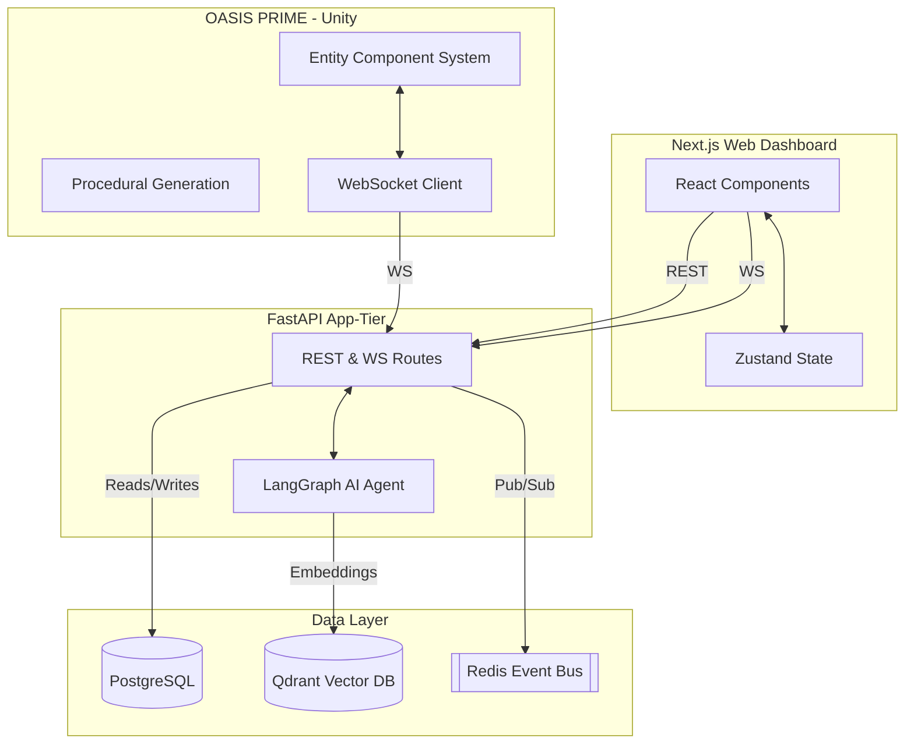

# Architecture Diagram (vMAX)

OASIS SYSTEM CORE is built on a highly decoupled, event-driven architecture designed to bridge web dashboards, AI agents, and 3D simulations.

## Scaling the Sync Layer
12. **Master-Plan (Module 12)** - Eternal roadmap tracking & AI media pipeline control.
13. **Sync Layer (Module 13)** - Redis Pub/Sub backend tying all modules together.

## Production Deployment (Swarm / K8s)
For production readiness, the ecosystem is fully containerized.
- **App-Tier (FastAPI)**: Deploy 3-5 replicas behind an NGINX Ingress controller or AWS ALB.
- **Data-Tier (Redis/Postgres/Qdrant)**: Deploy using managed services (AWS ElastiCache, RDS, managed Qdrant) to ensure state persists across catastrophic node failures.
- **Web-Tier (Next.js)**: Build output to Vercel or run as a standalone Node.js Docker container on the edge. Every action from the Unity game (e.g., player movement, combat) is emitted as a JSON payload over WebSockets to the App-Tier, which publishes it to Redis. The Web Dashboard subscribes to these channels to render live telemetry.
